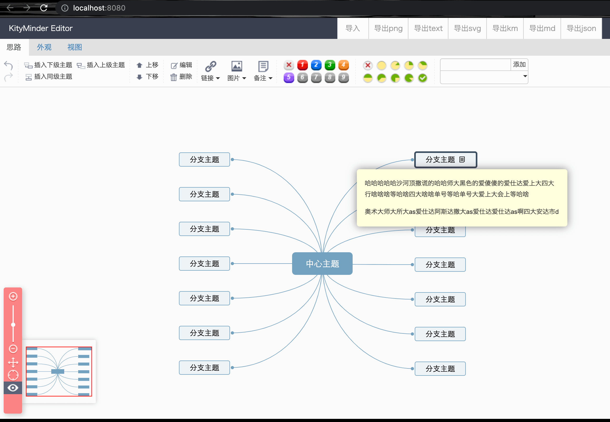

```
npm i ymfl-kityminder
```

## main.js
```
import 'ymfl-kityminder/dist/index.css'
import kityMinder from 'ymfl-kityminder'

Vue.use(kityMinder)

```

## 组件中使用

```
 <kityMinder
     :value="JSON.stringify(json)"
     :type="type"
     @init="initHandler"
     @destroyed="destroyedHandler"
     @import="importHandler"
     @export="exportHandler"
     @contentchange="contentchangeHandler"
 >
     <span slot="title">title</span>
 </kityMinder>
```

## 暴露方法参数说明
init: editor, minder

destroyed: 无

import: content, type

export: content, type

contentchange: content, type

## 效果展示

<!---->

## 测试数据
```
value: {
    'data': {
      'id': 2,
      'text': 'Design project',
      'image': 'http://image.namedq.com/uploads/20191011/18/1570789062-WiOwJhGFDp.jpg',
      'imageSize': { 'width': 200, 'height': 200 }
    },
    'children': [
        {
            'data': { 'text': 'Designsy', 'priority': 1, 'id': 3 },
            'children': [
                {
                  'data': { 'text': 'Designsy', 'id': 4 },
                  'children': [
                    { 'data': { 'text': 'Designsy', 'id': 5 } },
                    { 'data': { 'text': 'Designsy', 'id': 5 } },
                    { 'data': { 'text': 'Designsy', 'id': 5 } },
                  ]
                },
                { 'data': { 'text': 'Designsy', 'id': 5 } },
                { 'data': { 'text': 'Designsy', 'id': 62 } },
                { 'data': { 'text': 'Designsy', 'id': 73 } },
                { 'data': { 'text': 'Designsy', 'id': 84 } }
            ]
        },
        { 'data': { 'text': 'Designsy', 'priority': 2, 'id': 9 } },
        { 'data': { 'text': 'Designsy', 'priority': 3, 'id': 102 } },
        { 'data': { 'text': 'Designsy', 'priority': 4, 'id': 113 } },
        { 'data': { 'text': 'Designsy', 'priority': 5, 'id': 124 } }
    ]
}
```


## 求助

nuxt框架引入该组件，不成功 请大佬帮解决 谢谢

nuxt框架引入该组件，不成功 请大佬帮解决 谢谢

nuxt框架引入该组件，不成功 请大佬帮解决 谢谢

nuxt框架引入该组件，不成功 请大佬帮解决 谢谢

nuxt框架引入该组件，不成功 请大佬帮解决 谢谢

nuxt框架引入该组件，不成功 请大佬帮解决 谢谢

nuxt框架引入该组件，不成功 请大佬帮解决 谢谢

nuxt框架引入该组件，不成功 请大佬帮解决 谢谢

nuxt框架引入该组件，不成功 请大佬帮解决 谢谢

nuxt框架引入该组件，不成功 请大佬帮解决 谢谢
